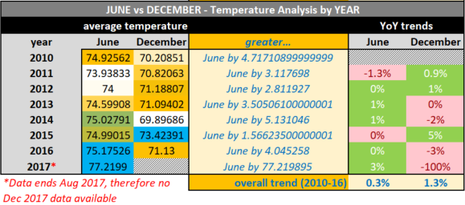

# Module 9 Challenge - Surf's Up

## Challenge Overview

- Determine key statistical data about the month of June.
- Determine key statistical data about the month of December.
- Compare your findings between the month of June and December.
- Make 2 or 3 recommendations for further analysis.

## Resources
Data Sources: [hawaii](hawaii.sqlite), [June vs December Analysis](june_vs_december_analysis.xlsx)

Software: Python - matplotlib, numpy, pandas, datetime, sqlalchemy; Microsoft Excel

## Challenge Summary

### June Statistics

### December Statistics

- June (1,700) overall had about 12% more records to analyze then December (1,517), however it is noted that the last date within the data set is in August 2017, therefore June had one extra years worth of data to analyze

- on average, December (0.22 inches) had slightly more precipitation than June (0.14 inches), while June had slightly higher average temperature (74.9 F) then December (71.0 F) - both differences considered inconsequential

- the standard deviations for both June (0.34) and December (0.54) precipitation show that December's precipitation is slightly more spread out then June, but since both are well below 1, these differences are considered inconsequential and shows the data is overall closely clustered to their respective averages

- the standard deviation for both June (3.26) and December (3.75) temperatures show that both months appear similarily spread out

- the lowest amount of precipitation for any given day in both June and December was nil, while the highest amount of precipitation recorded for June was 4.43 inches and for December 6.42 inches

- the second quartile for June precipitation is 0.02 inches while December is 0.03 inches, and the third quartile for June is 0.12 inches while December is 0.15 inches, showing that majority of precipitation for both months is generally under 0.15 inches, therefore the highest amounts of precipitation for both months are considered outliers (for June, anything over 0.30 and for December, anything over 0.38, are considered outliers)

- the lowest temperature for June is 64 F while December is 56 F, and the highest temperature for June was 85 F and for December 83 F

- the first quartile for June temperature is 73 F while December is 69 F, the second quartile for June is 73 F while December is 69 F, and the third quartile for June is 77 F while December is 74 F, showing that June temperature is slightly higher than December overall, therefore the highest termperatures for both months are considered outliers (for June, anything over 83 F and for December, anything over 81.5 F, are considered outliers)

**Recommendations for further analysis**

It is recommended to further analyze the differences year-over-year, as well as station vs station, to further understand the weather patterns. Please see below for related analyses:

*June vs December - Precipitation by Year*

-there is an overall downward trend for both June (-25.4%) and December (-22.6%) regarding number of days of precipitation from 2010 to 2016

-similarily, there is also an overall downward trend for both June (-27.9%) and December (-18.1%) regarding total amounts of precipitation from 2011 to 2016 (it is observed that 2010 had abnormal amounts of precipitation compared to other years, therefore 2010 was eliminated from this analysis in order to not misrepresent the overall trend)

*June vs December - Temperature by Year*

- both June and December showed very little change YoY regarding average temperatures

*June vs December - Precipitation by Station*

- the station "USC00518838" had the lease amount of days of precipitation as compared to the rest, as well as the least total amount of precipitation
    - based on this analysis, it would appear that any location within close proximity to "USC00518838" would have the least impact due to precipitation as compared to all other locations

*June vs December - Temperature by Station*

- the station "USC00518838" had average temperatures very close to the overall average temperatures for both June and December, further reinforcing the notion that any location in close proximity to "USC00518838" would be an ideal location 

-based solely on highest average temperatures recorded, the station "USC00514830" had the third highest average temperature for June and the highest average temperature for December

## Report Completed By:

